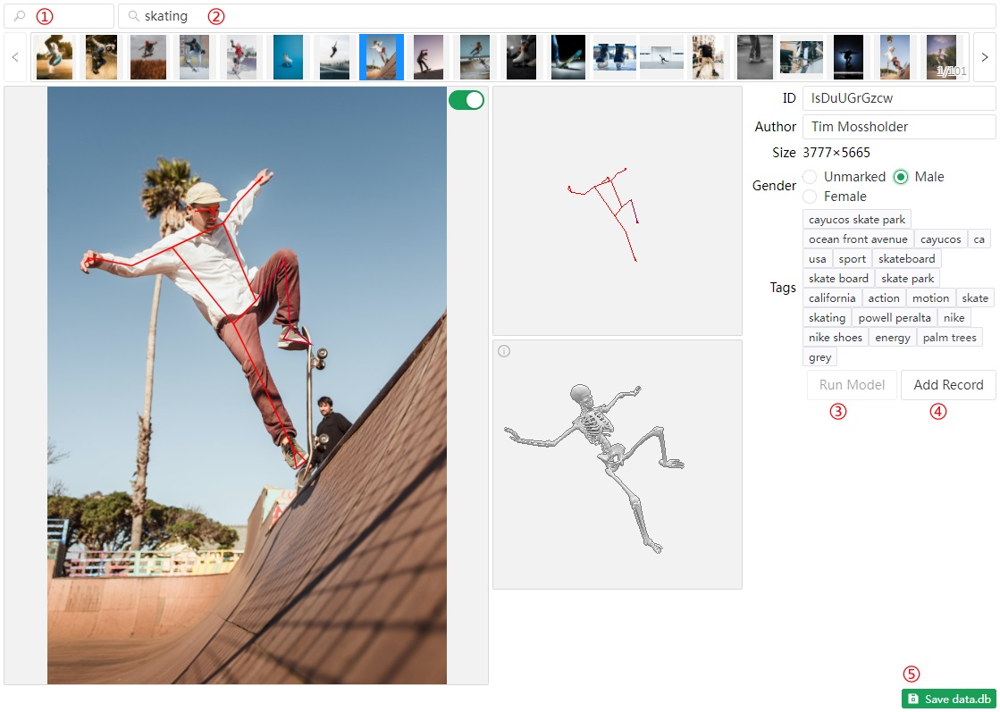

# x6ud.github.io/pose-search

## Project setup

```
npm install
```

## Development

Run `npm run build` first to copy some library files from /node_modules to /public.

```
npm run dev
```

## Compiles and minifies for production

```
npm run build
```

## Adding data

Get an app key from `https://unsplash.com/oauth/applications`.

Run the project with `npm run dev`.

Open `/#/editor`, paste your app key into the textbox requesting it.

